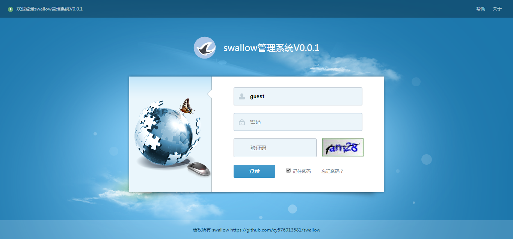
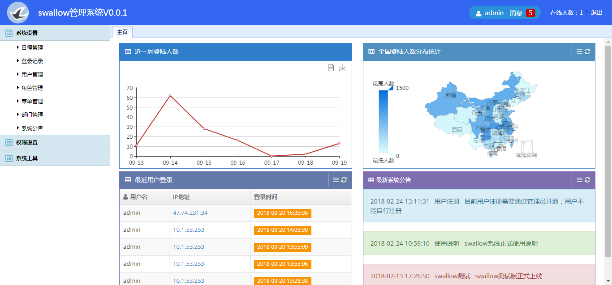

# swallow
#### 项目地址：http://39.108.143.76:8090/index

## 后台： 
   #### SpringMVC 
   #### Mybatis 
   #### Freemarker 
   #### Shiro 
   #### MybatisPlus 
   #### RabbitMQ 
   #### Druid 
   #### Mysql 
   #### FastJSON 
   #### Redis 
   #### Lombok 
   #### Swagger 
   #### EhCache 
   #### activiti 

***
## 前端： 
   #### 整体：easyui和ace admin 
   #### 文件上传：Dropzone.js   or  Web Uploader 
   #### 日历：calendar 
   #### 弹窗：layer 
   #### 数据展示：Echarts 
   #### 消息提示：toarst
***

## 开发日志 
- 2017.8.22 添加Redis缓存、测试实例和安全加密工具类	add by cy

- 2017.8.23 mybatis添加mapperxml、grid修改下拉框bug	add by cy

- 2017.8.24 添加BaseEntity以及相应的数据库存储	add by cy

- 2017.8.24 添加用户登录记录，修改获取IP的类	add by cy

- 2017.8.25 添加用户登录记录查询查看，查看功能还需修改，以使封装的easyui框架适应field.option这种格式的属性
		   发现分页查询时#BUG001  在列表页点击下一页之后再次点击查询，查询的数据不能被赋值，当第二次点击查询的时候可以正常的显示。目前暂时找不到问题出在哪，
		   服务端返回的数据是正常的，应该是数据绑定的时候出问题了。但是如果不点击下一页，可以正常工作	add by cy
		   
- 2017.8.24 grid修改基本完成，calendar还需完善	add by cy

- 2017.9.01 calendar日程管理基本完成，添加文件上传模块	add by cy

- 2017.9.17 添加shiro权限控制，权限分配尚未完成	  add by cy

- 2017.9.20 权限配置基本完成，无权限提示还需完善	add by cy

- 2017.9.22 用户密码添加md5加密，修改获取当前用户名的基类方法，json添加msg变量，修复登陆第一次点击不跳转	add by cy

- 2017.9.23 添加JsonUtil工具类，添加fastjson，初步出完善权限拦截器，还待优化	add by cy		 

- 2017.9.24 shiro权限异常返回json，权限配置完成	add by cy

- 2017.9.29 shiro登录全部完成	add by cy

- 2017.9.30 集成shiro之后，去除之前的默认的拦截器	add by cy

- 2017.9.30 tabs菜单，双击事件   add  by  zyj

- 2017.10.1 持久层集成MP,修改所有的持久层方法，修改业务层接口名称   add  by  cy

- 2017.10.8 添加权限、角色管理   add  by  cy

- 2017.10.9 添加权限、角色的中文名称字段，添加建库sql，grid模板添加列的hidden   add  by  cy

- 2017.10.10 集成druid数据源，添加用户锁定功能   add  by  cy

- 2017.10.11 去掉启动类的多余备注，修改登录页样式 ，主页样式修改  add  by  cy

- 2017.10.15 添加用户关联角色，角色关联角色功能  add  by  cy

- 2017.10.16 修改shiro的权限控制BUG add  by  cy

- 2017.10.17 查询结果的List中的bean中有变量是null使用@JsonInclude(JsonInclude.Include.NON_NULL)排除,grid页面加载优化 add  by  cy

- 2017.10.22 STORY14：页面管理添加用户锁定/解锁功能,STORY16：系统菜单的存储优化（决定放入数据库）   add  by  cySTORY: 添加MP代码生成器

- 2017.10.28 STORY20：添加MP代码生成器   add  by  cy

- 2017.11.05 STORY21：集成RabbitMQ，并且将插入登录信息放到消息队列实现   add  by  cy

- 2017.11.06 集成activiti环境 add  by  cy

- 2017.11.26 用户添加邮件字段，集成邮件服务（还未测试） add  by  cy

- 2017.11.29 修复用户信息修改bug add  by  cy

- 2017.12.1 消息队列实现用户注册邮件发送管理员提示激活，STORY24: 使用定时器，定时向管理员汇报系统情况(具体发送内容需要完善) add  by  cy	

- 2017.12.8 activiti文件部署初步完成，还未测试  add  by  cy

- 2017.12.9 activiti流程部署和list显示完成  add  by  cy  

- 2017.12.9 优化grid的提交方式，还需要完善  add  by  cy  

- 2017.12.10 优化了grid提交方式，流程部署后台文件的接收需要更改  add  by  cy  

- 2017.12.11 暂时放弃用在grid集成中提交文件，放到后期优化，原因是集成shiro之后HttpServletRequest变成ShiroHttpServletRequest，
			  转换又因为springboot内置的文件上传和commons-fileupload冲突  add  by  cy  
	
- 2017.12.11 文件部署完成  add  by  cy  

- 2017.12.11 流程定义列表和流程图查看完成  add  by  cy  

- 2017.12.16 添加请假单list，修改持久层的查找方法。  add  by  cy 

- 2017.12.17 优化grid的fields读取，优化grid的组件隐藏方式  add  by  cy 

- 2017.12.17 完成请假单的管理功能  add  by  cy 

- 2017.12.18 流程启动完成，完成任务管理列表的编码，还未测试 add  by  cy 

- 2017.12.21 查看当前流程图未完成，完成任务有报错 add  by  cy

- 2017.12.26 任务完成模块完成，审核批注未完成 add  by  cy

- 2017.12.27 请假流程基本完成，还有查看当前流程流程图 add  by  cy

- 2017.12.28 完成查看当前流程流程图，activiti请假单申请完成 add  by  cy

- 2017.12.31 新增一套主页模板 add  by  cy

- 2018.1.3 添加部门管理,用户管理添加部门，细节还没完善 add  by  cy

- 2018.1.7 用户关联部门完成  add  by  cy

- 2018.1.9 redis缓存登陆用户在获取时还有对象转换的问题，等待优化  add  by  cy

- 2018.1.11 使用redis添加用户登录错误次数限制功能，并且缓存登陆用户  add  by  cy

- 2018.1.15 添加项目启动缓存所有用户、优化grid界面查询框，使用table布局  add  by  cy  

- 2018.1.26 完善loginout链接  add  by  cy  

- 2018.1.31 STORY31:使用AOP替换调用基类方法的entity公共字段的数据填充  by  cy 

- 2018.2.1 使用echarts展示近7天系统用户登陆情况  by  cy 

- 2018.2.2 实现实时在线人数的统计、实现记住密码功能 by  cy 

- 2018.2.3 实现最近登录用户显示  by  cy 

- 2018.2.9 STORY32: 添加登录记录的ip地址的进行http判断，在首页显示登录的流量地图显示（人数统计还未实现）  by  cy 

- 2018.2.23 添加首页系统公告的显示和系统公告的管理  by  cy 

- 2018.2.24 修改http请求工具类，添加新浪ip库（在淘宝库获取失效时启用）  by  cy 

- 2018.2.28 修改登录密码输入错误锁定之后不解锁的bug  by  cy 

- 2018.3.16 添加登录记录中添加详细城市  by  cy 

- 2018.3.20 对所有的API接口进行RRSTFul风格改造  by  cy

- 2018.3.20 对后台返回json数据优化，去除空值字段，修复grid组件中的编辑显示数据BUG  by  cy

- 2018.4.9 grid的button按钮样式修改  by  cy

- 2018.4.9 加入Lombok，简化实体的代码量  by  cy

- 2018.4.16 对返回结果进行统一封装 by  cy

- 2018.4.18 配置文件改为yaml格式 by  cy

- 2018.4.20 完善checkTree、datalist组件 by  cy

- 2018.4.27 由于Easyui的目前解决不了动态选中，checkTree组件暂时不设置checkbox，完成根据角色设置对应菜单，并且根据角色显示对应菜单 by  cy

- 2018.7.20 JDK升级为10 by  cy

- 2018.8.13 暂时取消activity模块，升级之后与springboot冲突，报Error creating bean with name 'requestMappingHandlerMapping by  cy

- 2018.8.13 Redis服务器到期，暂时注释Redis缓存代码，后面优化成内存缓存 by  cy

- 2018.8.13 消息队列服务器到期，暂时注释rabbitmq代码 by  cy

- 2018.8.13 添加SwaggerAPI文档工具 by  cy

- 2018.8.14 集成EhCache by  cy

- 2018.8.15 日志打印使用lombok的@Slf4j by  cy

- 2018.8.18 系统的动态菜单采用缓存 by  cy

- 2018.8.19 对用户进行缓存,登录添加验证码 by  cy

- 2018.8.20 优化启动方法 by  cy

- 2018.8.25 我这个伪前端稍微修改了下主页样式 by  cy

- 2018.8.26 STORY33: 新增在线人数列表显示界面，主页样式进行了小修改 by  cy

- 2018.8.28 登录界面做了小修改,恢复消息队列和redis by  cy

- 2018.8.29 首页用户登录数量做了缓存处理 by  cy

- 2018.9.1 添加docker构建 by  cy

- 2018.9.3 登录成功之后锁定登录按钮,swagger中不需要的接口取消显示 by  cy

- 2018.9.13 修改登录bug  by  cy

- 2018.9.14   by  cyshiro的权限验证成功解决，采用注解方式，无权限异常采用BaseController异常捕捉

- 2018.9.15 把所有的权限控制完成，删除一些低效代码，无权限提示完成，角色权限页面tree修改完成  by  cy

- 2018.9.19 后台查询优化，部分bug修复  by  cy

- 2018.9.20 后台代码结构优化 by  cy

- 2018.9.29 修复查询bug by  cy

- 2018.10.8 excel工具类待完善 by  cy
